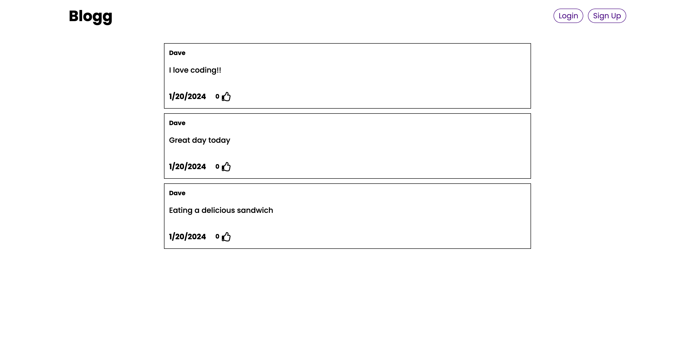
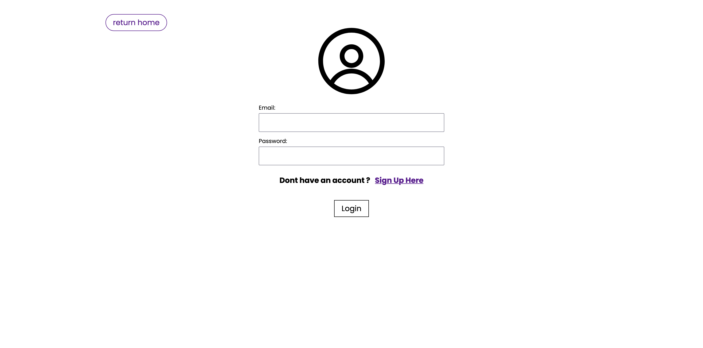

# Blog App

Blog app to practice web development

## Frontend
- React
- React Router DOM
- React Toastify

## Backend
- Express.js
- Mongoose.js
- Dotenv
- JsonWebToken
- Cors
- Bcrypt
- Nodemon (dev dependency)

## Homepage (unauthenticated)

## Authentication Page

## Homepage (authenticated)
